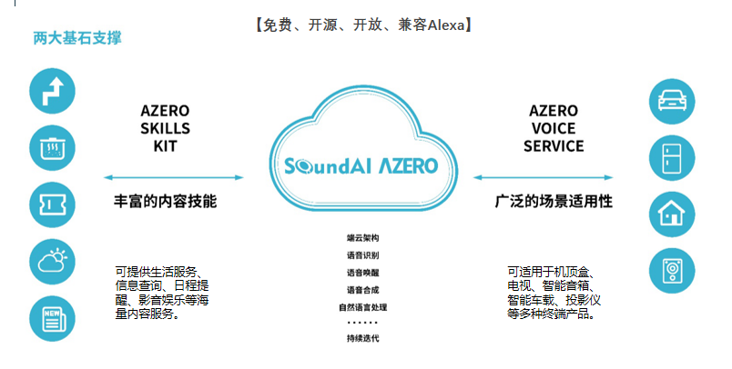
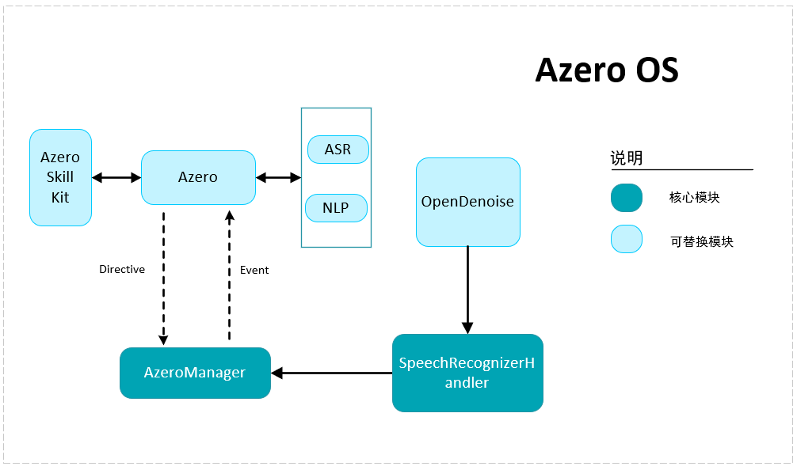
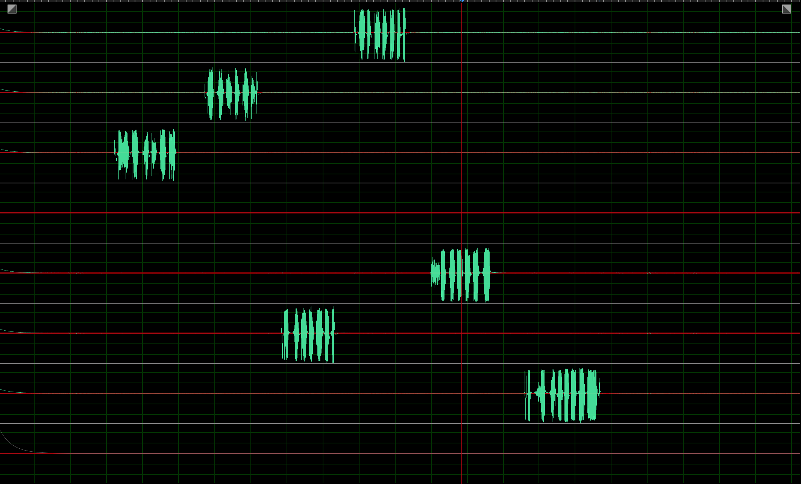
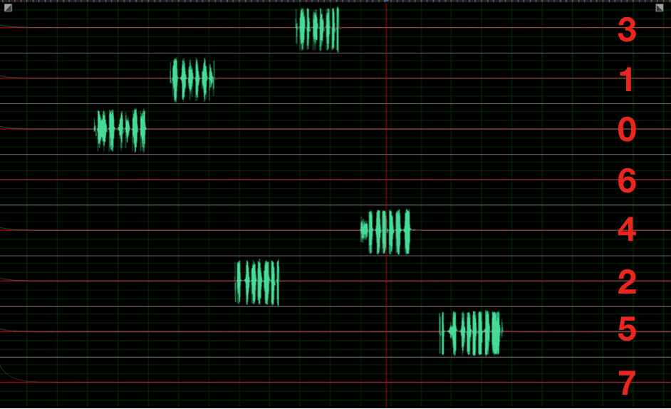
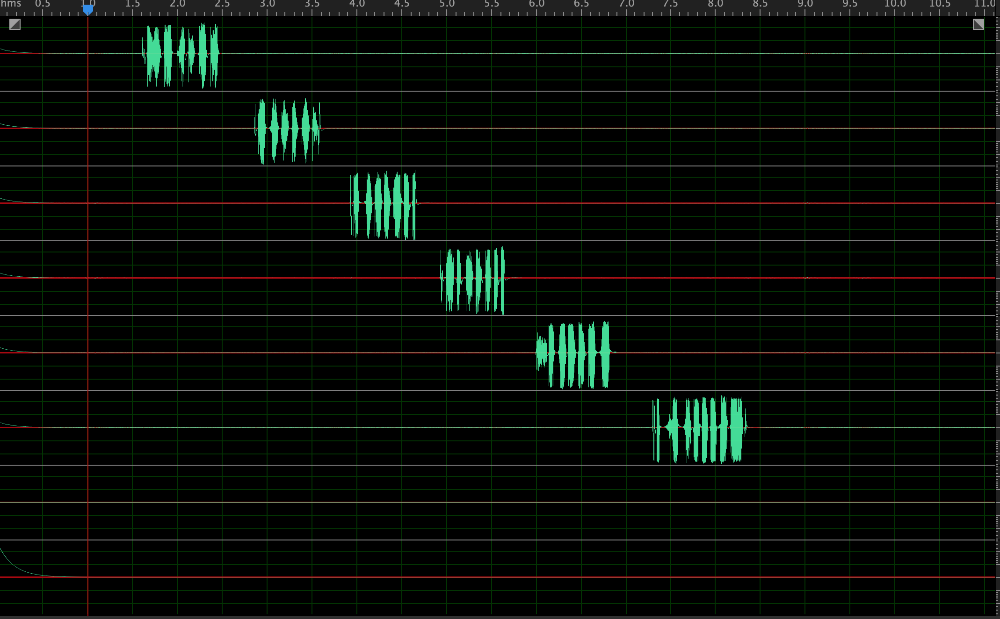

<div align="right">

</div>

# 声智Azero系统说明文档

[TOC]

# 版本说明

|  更新日期  | 更新内容 |
| :--------: | :------: |
|  2019/8/1  |  v1.0.0  |
| 2019/11/29 |  v1.2.0  |


# 一、功能概述



Azero Sample提供Azero系统接入示例代码，包含语音唤醒、ASR、NLP、用户交互解决方案等。您可以通过此文档理解Azero系统的架构设计，获知各个模块的详细使用说明以及如何开发和使用自定义技能。


# 二、基本架构



## 1.云端大脑	

Azero系统的逻辑处理部分全部在云端进行，用户与端上进行的所有交互都通过Event反馈到云端，云端进行判断后下发Directive交由端上执行。比如，当用户在播放音乐时点击了暂停按钮，此时系统并不会立即调用播放器的暂停，而是上报给云端暂停事件，云端分发给Skill处理完成后，将暂停的Directive下发给端上，完成暂停的动作。

云端大脑模式便于用户定义自己Skill的技能。例如，在默认情况下，“睡眠模式”会走到闲聊的模块，用户部署了自定义的“睡眠模式”技能后，该类型对话对应的Directive则会导向到用户定义的端上功能模块，从而完成用户自定义技能的开发。

## 2.核心组件

Azero系统与用户交互相关的核心控制模块主要有`FocusManager`、`SpeakerManager`、`DirectiveRouter`.

### FocusManager	

负责音频和界面显示焦点的管控，使用音频通道或显示通道前需要向此模块申请焦点，申请成功后才可使用，否则可能出现显示上的异常。

默认焦点说明：

| 音频焦点       | 焦点优先级 |
| -------------- | :--------- |
| DIALOG         | 100        |
| ALERTS         | 200        |
| COMMUNICATIONS | 300        |
| CONTENT        | 400        |

| 视频焦点 | 焦点优先级 |
| -------- | ---------- |
| VISUAL   | 100        |

| 焦点状态   |              |
| ---------- | ------------ |
| FOREGROUND | 持有焦点     |
| BACKGROUND | 临时失去焦点 |
| NONE       | 未持有焦点   |

数值越低焦点优先级越高，申请流程如下，假设此时正在播放歌曲，音乐播放使用的焦点为CONTENT，此时唤醒操作使用DIALOG焦点申请权限，由于DIALOG < CONTENT，因此焦点申请成功，音乐播放切换到BACKGROUND，暂时暂停播放，唤醒弹窗持有焦点，弹窗结束后，音乐播放重新切换为FOREGROUND，继续播放音乐。

### SpeakerManager

音乐，TTS，闹钟等等都拥有各自独立的播放器，这些播放器统一在SpeakerManager中管理，需要进行调节音量等操作时需要调用此类中的函数，SpeakerManager会逐一调用对应播放器的音量接口，如果检查发现某个播放器的音量不统一，可能会导致音量调节失败。

### DirectiveRouter

Directive接收类需要预先实现CapabilityConfigurationInterface和CapabilityConfigurationInterface接口，并在系统启动时注册进~~DirectiveRouter~~中。在接收云端指令时，Router会根据Directive所携带的NameSpace和Name进行分发管理。


# 三、Azero接入

## 导入工程

使用Android Studio打开`Azero_SDK_for_Android`工程。首次打开需要等待 Gradle 联网下载一些依赖库，可能需要较长时间，需要保持网络畅通。

连上开发设备，运行`Azero_SDK_for_Android`工程, 并安装到设备。这就是一个最基础的 Azero OS设备端实现。


## 启动Azero

启动Azero需要传入一些必要设备配置（Config）和功能模块（HandlerContainer）

### Config

`Config` 是设备基本信息配置类，主要包括以下主要信息：

- **productId** 产品ID，Azero开发者网站上申请，设备信息中填写
- **clientId** Azero开发者网站上自动生成，设备信息页可查询
- **server** 此选项默认Config.SERVER.PRO,为当前的线上server , 除非特殊联调情况，请勿使用其他选项，否则会存在无法使用的情况
- **enableWakeUp**  开关唤醒，默认为true。例如场景：夜间，可关闭唤醒进入免打扰；白天，打开唤醒继续使用
- **enableNoNeedWakeup** 开关免唤醒模式，默认为false。免唤醒模式下，不需要唤醒，直接命中技能
- **useOpenDenoise** 是否使用降噪算法，默认为true。系统自带了Open Denoise算法库，不使用的话，直接灌原始音频
- **enableLocalVAD**  是否使用本地VAD，默认为true。不使用，走的是云端VAD（准确度相对于本地差）
- **showSetVolume**  调节音量时， 音量调节UI是否显示， 默认为true。
- **ttsStreamType**  TTS播放器音频流类型：STREAM_VOICE（语音通话类流类型）、STREAM_SYSTEM（系统类流类型）、STREAM_RING（铃声类流类型）、STREAM_MUSIC（音乐类流类型，默认选择）、STREAM_ALARM（闹钟类流类型）、STREAM_NOTIFICATION（通知类流类型）
- **timeoutList** Template 过期时间列表，主要包括：TTS播放完后消失的时间、音频播放完后界面消失时间、音频播放暂停时界面消失时间
- **customAudioCueMap** 自定义提示语
- **useCustomDenoise** 是否使用自定义的降噪算法， 默认为false

示例代码如下：

```java
//第一步 配置参数 注册必要模块 @{
	//定义界面消失时间，不填则使用如下默认值  （选配）
    private AzeroConfiguration.TemplateRuntimeTimeout[] defaultTimeout = {
            //Template界面在TTS播放完后消失的时间
            new AzeroConfiguration.TemplateRuntimeTimeout(AzeroConfiguration.TemplateRuntimeTimeoutType.DISPLAY_CARD_TTS_FINISHED_TIMEOUT, 8000),
            //音频播放完后界面消失时间
            new AzeroConfiguration.TemplateRuntimeTimeout(AzeroConfiguration.TemplateRuntimeTimeoutType.DISPLAY_CARD_AUDIO_PLAYBACK_FINISHED_TIMEOUT, 300000),
            //音频播放暂停时界面消失时间
            new AzeroConfiguration.TemplateRuntimeTimeout(AzeroConfiguration.TemplateRuntimeTimeoutType.DISPLAY_CARD_AUDIO_PLAYBACK_STOPPED_PAUSED_TIMEOUT, 300000)
    };
    //自定义本地声音资源（选配）
    private Map<AbsSpeechRecognizer.AudioCueState, List<Integer> customAudioCueMap = new HashMap<>();
    customAudioCueMap.put(AbsSpeechRecognizer.AudioCueState.START_TOUCH, 本地资源list)；
    customAudioCueMap.put(AbsSpeechRecognizer.AudioCueState.START_VOICE, 本地资源list)；
    customAudioCueMap.put(AbsSpeechRecognizer.AudioCueState.END, 本地资源list)；
     ConfigSetting config = new ConfigSetting.ConfigBuilder()
                .setProductID("") //必配
                .setClientID("") //必配
                .setServerType(Config.SERVER.PRO) //必配
                .enableWakeUp(true) //选配
                .enableNoNeedWakeup(true) //选配
                .useOpenDenoise(false) //选配
                .enableLocalVAD(false) //选配
                .showSetVolume(false) //选配
                .setTTSStreamType(Config.TTSStreamType.STREAM_MUSIC) //选配
                .setTemplateRuntimeTimeout(defaultTimeout) //选配
                .setCustomAudioCueMap() //选配
                .setUseCustomOpenDenoise(true) //选配
                .create();

        AzeroManager.getInstance().startEngine(new SystemRecord(),null,config);
```


### HandlerContainer

`HandlerContainer`主要用于注册和替换自定义的播放器以及注册必要的Handler。

配置项主要包含：

- setVideoHandler 视频类Handler, 当前支持蜜蜂视频（默认）、爱奇艺、优酷等, 这些第三方视频app 均需另行安装。

- setAudioHandler 有声类Handler, 当前支持SoundAI自有有声，无需另行安装
- setMusicHandler 音乐类Handler, 当前支持SoundAI自有音乐（默认）和咪咕音乐（需另行安装并联系我们授权）
- setPhoneCallHandler 通话类Handler，当前支持SoundAI自有PHONE类型

以`VideoHandler`为例，如想体验蜜蜂视频除了配置 HandlerContainer 中VideoHandler，还需要在Azero官网上为你填写的设备配置对应的蜜蜂视频技能。

配置必要的Handler：

- setSpeechRecognizer 识别模块的Handler

**注：**HandlerContainer同一类别模块只支持注册一个，同时注册多个时，选择最后注册的模块。


### 启动Azero
配置完上述的参数，就可以初始化Azero。
```java
try {
     //启动引擎
     AzeroManager.getInstance().startEngine(new SystemRecord(),null,config);
} catch (RuntimeException e) {
    log.e("Could not start engine. Reason: " + e.getMessage());
}
```

初始化过程异常已通过RuntimeException异常抛出，可通过捕获该异常情况获取初始化过程异常信息。

### 渲染Template

配合语音交互指令，TemplateRuntimeHandler会下发配套的界面内容，用户可根据自己的需求，渲染界面

```java
  //各技能回调注册，如asr、navigation
        List<String> services = new ArrayList<>();
        services.add(Constant.SKILL.ASR);
        services.add(Constant.SKILL.NAVIGATION);
        services.add("renderPlayerInfo");
        services.add(Constant.SKILL.WEATHERTEMPLATE);
        services.add("BodyTemplate1");
        services.add("BodyTemplate2");

        services.add("ListTemplate1");
        services.add("DefaultTemplate1");
        services.add("DefaultTemplate2");
        services.add("DefaultTemplate3");

        services.add("LocalSearchListTemplate1");

        services.add("AlertsListTemplate");
        services.add("AlertRingtoneTemplate");
        services.add("LauncherTemplate1");
        //各种技能结果回调
        AzeroManager.getInstance().registerAzeroExpressCallback(services, mAzeroCallBack);

        //系统状态回调类
        AzeroManager.getInstance().addAzeroOSListener(new AzeroOSListenerImpl());
        //各状态回调注册唤醒、开始录音、结束录音等状态，用于更新UI
        AzeroManager.getInstance().registerUIListener(new UIListenerImpl());
```


# 四、API说明

## AzeroManager

### 创建对象

AzeroManager类实现了单例模式，提供如下获取方式

```java
 AzeroManager azeroManager = AzeroManager.getInstance()
```

### 初始化

```java
startEngine(Record record, AbstractOpenDenoise abstractOpenDenoise, ConfigSetting configSetting)
```

### 设置UI状态回调
```java
registerUIListener(IUIListener iuiListener)
```

### 移除UI状态回调
```java
unRegisterUIListener(IUIListener iuiListener)
```

### 设置技能回调（包含模版v2.0.0之前版本的template和azeroexpress技能，都是从此接口回调出去）
```java
registerAzeroExpressCallback(List<String> services, IAzeroExpressCallback callback)
```

### 移除技能回调
```java
unRegisterAzeroExpressCallback(IAzeroExpressCallback callback)
```


### 播放控制

```Java
executeCommand(@NotNull Command command)
```

Demo 中实现了一个简单的、用于显示正在播放的媒体的页面，主要逻辑代码位于 PlayerInfoActivity中，其中真正触发播放控制的是以下代码

| Command                     | 说明                      |
| --------------------------- | ------------------------- |
| CMD_PLAY_PLAY               | 播放指令                  |
| CMD_PLAY_PAUSE              | 暂停指令                  |
| CMD_PLAY_NEXT               | 下一首                    |
| CMD_PLAY_PREVIOUS           | 上一首                    |
| CMD_VOLUME_UP               | 音量增大（10%）           |
| CMD_VOLUME_DOWN             | 音量降低（10%）           |
| CMD_PLAY_AUDIO_SERVER_ERROR | 播放提示音-服务器连接失败 |
| CMD_PLAY_AUDIO_NET_ERROR    | 播放提示音-网络无法连接   |

### 静音控制

```java
/**
 * 设置播放器静音
 *
 * @param mute ture 静音 false 取消静音
 */
public void executeSetMute(boolean mute)
```

### 禁止tts播放(since V1.3.0)

```java
/**
 * 开启TTS
 *
 */
public void enableTts() {
    speakerMediaplayerHandler.enableTts();
}

/**
 * 禁用TTS
 *
 */
public void disableTts() {
    speakerMediaplayerHandler.disableTts();
}
```

### 文字请求tts(since V1.3.0)

```java
/**
 * 请求tts播报的接口，发送文字，sdk即可直接播放对应的tts流
 * 注：使用该接口，需联系声智产品人员开通
 * @param content
 */
public static void acquireTts(String content) {
    Utils.acquireTts(content);
}
```


### 发送文字query(since V1.3.0)

```java
/**
 * 发送文字模拟语音输入
 * @param query 模拟语音的文字接口
 */
public static void sendQueryText(String query) {
    Utils.sendQueryText(query);
}
```


### 系统音量设置

```java
/**
 * 设置系统音量,通过其他方式更改系统音量时需调用此接口传入，否则可能导致音量变化不正常
 *
 * @param volume
 */
public void executeSetVolume(int volume)
```

### 停止所有播放器

```java
public void stopAllPlayers()
```

### 获取系统功能模块

```java
public PlatformInterface getHandler(String name)
```

| Handler                   | 说明       |
| ------------------------- | ---------- |
| ALERT_HANDLER             | 闹钟       |
| AUDIO_HANDLER             | 音频播放器 |
| SPEAKER_HANDLER           | TTS播放器  |
| SPEECH_RECOGNIZER_HANDLER | 识别数据   |
| TEMPLATE_HANDLER          | 显示模板   |
| AZERO_CLIENT_HANDLER      | 连接状态   |

### 系统事件

```java
public void addAzeroOSListener(AzeroOSListener listener)
public void removeAzeroOSListener(AzeroOSListener listener)
```

| AzeroEvent                           | Msg  | 说明               |
| ------------------------------------ | ---- | ------------------ |
| EVENT_AUTH_STATE_CHANGE              |      | Auth状态变化       |
| EVENT_AUTH_STATE_ERROR               |      | Auth失败           |
| EVENT_CONNECTION_STATUS_CHANGED      |      | Server连接状态变化 |
| EVENT_ENGINE_INITIALIZATION_COMPLETE |      | 系统初始化完成     |
| EVENT_VOLUME_CHANGE                  |      | 系统音量变化       |

### 播放器的状态回调

获取有声类播放器状态

```java
        MediaPlayerHandler mediaPlayerHandler = (MediaPlayerHandler) AzeroManager.getInstance().getHandler(AzeroManager.AUDIO_HANDLER);
        mediaPlayerHandler.setAudioPlayerListener(new MediaPlayerHandler.AudioPlayerListener(){
        @Override
        void onAudioPlayerStopped();
        @Override
        void onAudioPlayerStarted();
        @Override
        void prepare();
        @Override
        void play();
        @Override
        void stop();
        @Override
        void pause();
        @Override
        void resume();
        @Override
        void seekTo(long position);
       
        })
```


获取tts音频播放器状态

```java
        RawSpeakAudioMediaPlayerHandler speakerMediaPlayerHandler = AzeroManager.getInstance().getSpeakerMediaplayerHandler();
        speakerMediaPlayerHandler.setRawSpeakAudioMediaPlayerListener(new RawSpeakAudioMediaPlayerHandler.RawSpeakAudioMediaPlayerListener() {
            @Override
            public void onSpeakerMediaPlayerStopped() {}
            @Override
            public void onSpeakerMediaPlayerStarted() {}
            @Override
            public void prepare() {}
            @Override
            public void play() {}
            @Override
            public void stop() {}
            @Override
            public void pause() {}
            @Override
            public void resume() {}
            @Override
            public void seekTo(long position) {}
        });
    }
```

### 自定义指令

```java
/**
 * 自定义技能模块
 *
 * @param IAzeroExpressCallback 自定义技能模块的基类
 * @return 注册是否成功
 */
public boolean registerAzeroExpressCallback(List<String> services, IAzeroExpressCallback callback)

```


# 五、Open Denoise（此部分在v2.0.0及之后的版本已经默认在aezro-release.aar内部实现，外部只需要将配置信息按照demo方式放置到assets目录即可）

Azero Sample中默认配置了声智自有的声学算法Open Denoise，支持远场麦克风阵列的降噪、唤醒、AEC等，无需做任何改动即可使用。

Open Denoise模块的数据入口为feedData函数，该函数需要客户将设备上的远场多路数据灌入到Open Denoise，当前工程中默认配置了Android标准接口采集的近场单mic数据可进行初始调试和近场演示使用，如需配置远场数据，需要客户自行打通多路mic加回采的数据链路，并将16k 16bit的pcm数据feed进来，或者您可以选择使用声智开源的basex数据采集工具来完成原始数据的采集工作，具体可参考下一章节内容。

## 原始数据要求

Open Denoise对原始数据有一定的格式的要求，具体如下：

1. 采样率为 16k
2. 采样位深为 16bit
3. 格式为 pcm音频
4. 通道顺序
   - 环形阵型：麦克风逆时针排布序列和原始数据通道序列相同，即逆时针依次触摸mic孔, 录制的原始音频通道呈顺序序列
   - 线性阵型：麦克风从左到右排布序列和原始数据通道序列相同，即从左到右依次触摸依次触摸mic孔, 录制的原始音频通道呈顺序序列
5. 回采通道必须紧挨着麦克风数据通道，中间不能存在空数据通道

## 声学参数配置

声学参数是声学处理的基础参数，需进行配置方能进行声学处理，当前声学参数配置需要声智工程师进行配置，正在开发工具开放相关参数。

## 唤醒模型配置

当前Azero会附带一个默认的唤醒模型，如需尝试其他唤醒模型，请联系声智相关人员。

## 其他模型文件

当前Azero会附带一套标准的通用模型文件，如有特殊需求，请联系声智相关人员。

## 使用流程说明

请参考turnkey sample的示例去使用，当前Open denoise必须配合整个Azero使用，无法单独使用，如需修改Open denoise调用相关示例，可参考如下流程：

1. #### 导入denoise-release.aar算法依赖库

   将压缩包里面的aar库放置在代码工程app/libs目录下

2. #### 引用aar库

   配置app gradle如下：

   ```java
   android {
   	allprojects {
       	repositories {
   			flatDir {
   				dirs 'libs'
   			}
   		}
   	}
   }
   
   dependencies {
   	implementation name: 'denoise-release', ext: 'aar'
   }
   ```


3. #### 相关配置文件

   将SoundAI 提供的配置文件放置在app/src/main/assets/config_s文件下，并参考demo工程中copy配置文件代码将配置文件拷贝到应用目录。

4. #### 获取算法SaiClient实例

   saiClient = SaiClient.getInstance();

5. #### 初始化SDK

   调用SaiClient.init函数初始化SDK

   初始化SDK时，需要从Azero SDK 中获取token:

   ```java
   /** @deprecated since Version 1.6.0*/
   AzeroManager.getInstance().generateToken()
   /** @added Version 1.6.0*/
   AzeroManager.getInstance().getToken()
   ```

   初始化示例如下所示：

   ```java
   saiClient.init( context,
                   true,
                   configPath,
                   "uuid",
                   AzeroManager.getInstance().getToken(context),
                   new SaiClient.Callback() {
                       @Override
                       public void onAsrDataCallback(byte[] data, int size) {
                       }
                       @Override
                       public void onVoipDataCallback(byte[] bytes, int size) {
                       }
                       @Override
                       public void onWakeupCallback(float wakeup_angle, String wakeup_word, float score, byte[] data) {
                       }
                       @Override
                       public void onVadCallback(int vadResult) {
                       }
                   }
   ```

   

6. #### 注册回调接口，接受并处理回调事件

7. #### 采集数据并喂给算法库

   saiClient.feedData(temp);

## 功能选用

1. 是否启用唤醒
   初始化时，第一个参数确定是否开启唤醒检测

```java
saiClient.init(true, configPath, "UUID", key, callback);
```

2. 是否使用vad检测
   如不需要vad检测，可忽略vad回调即可
3. 开启voip

```java
  //启用
  saiClient.startVoip()
  //关闭
  saiClinet.stopVoip()
```

## 问题分析

如声学处理open denoise 模块使用过程中遇到任何问题需要声智工程师协助分析，请提供如下信息：

1. issue说明
2. issue复现步骤
3. 从程序启动开始 ，至issue 发生之后的完整的logcat,并提供issue 发生的时间点（按照设备系统时间）
4. 音频文件：
   1）feedData 之前直接保存下来的原始音频文件，中间不能经过其他处理，务必保证该音频为feed到sdk的原始音频
   2）onAsrCallback 返回的asr音频
   3）onWakeupCallback 返回的wakeup音频

# 六、Basex

Basex是SoundAI Azero 附带的基于tinyalsa的开源的多路音频采集工具，其可以提供从tinyalsa系统录制多路麦克风加回采的原始pcm数据，可以提供远场语音算法提供原始音频作为原料，同时提供了对音频移位、调整通道顺序、降采样等功能。

## 使用前提

1. 标准的tinyalsa系统

   当前basex工具仅仅支持标准的tinyalsa系统，如设备中tinyalsa是经过裁剪或者其他音频系统，basex工具暂无法支持。

2. root权限

   由于basex需要直接读取alsa设备节点去实现原始音频采集，因此需要设备具有root权限来关闭selinux限制和赋予声卡节点读取权限方可使用，user版本Android设备将无法使用该方式。

3. 多路麦克风数据和回采数据诉求

   Basex工具是为了采集多路麦克风数据来适配远场语音交互的场景，或者需要提供回采数据来做AEC的情况下才需要启用Basex, 如您无此类需求，您可以直接使用Android标准接口提供的音频数据来作为语音交互的基础数据。

## 开启Basex

在Azero 中我们默认采用Android 标准音频接口作为音频数据来源，同时我们提供了简单的方式去启用Basex:

1. 初始化BasexRecord，放入engine

```java
AzeroManager.getInstance().startEngine(new BasexRecord(),null,config);
```

2. 开启系统权限：

   需要adb shell进入系统shell,执行如下shell命令

   1）setenforce 0. 关闭selinux限制

   2）chmod /dev/snd/*. 为声卡读或者更高权限

## 参数配置

Basex相关参数配置示例如下：

```java
int RUNTIME = -1;                                        // 录音时长，单位帧，-1：一直录音
String HW = "hw:0,0";                                    // 录音设备，hw:[card],[device]
int MIC_NUM = 6;                                         // mic 数量
int CHANNEL_NUM = 8;                                     // channel 数量
String CHANNEL_MAP = "0,1,2,3,4,5,6,7";                  // 通道顺序
int BIT = 32;                                            // 位深
int SAMPLE_RATE = 48000;                                 // 采样率
int MIC_SHIFT = 15;                                      // mic移位，默认不移位，值为16
int REF_SHIFT = 16;                                      // 回采移位，默认不移位，值为16
int PERIOD_SIZE = 512;                                   // 缓存大小，对应tinycap 的-p属性
int BUFFER_SIZE = 6;                                     // 缓存数量，默认4
```

1. alsa基本参数配置
   初始化Basex需要配置一些基本的alsa参数，这次参数设置错误将会导致basex初始化错误，这些参数在使用tinycap工具录音的时候也需要配置，跟tinycap使用的参数一致即可

  例如tinycap命令为

```java
tinycap /sdcard/test.pcm -D 0 -d 1 -c 8 -r 48000 -b 32 -p 2048 -n 2
```

- HW  hw:0,1 根据tinycap -D 0 -d 1
- CHANNEL_NUM 8 根据tinycap -c 8
- BIT 32 根据tinycap -b 32
- SAMPLE_RATE 48000  根据tinycap -r 48000
- PERIOD_SIZE 2048 根据tinycap -p 2048
- BUFFER_SIZE 2 根据tinycap -n 2

2. 通道顺序调整

   声智远场语音算法对原始音频的通道顺序存在固定要求，因此需要在将原始音频给到算法之前保证其通道顺序是符合要求的，具体要求请参考上一章中声智算法模块通道数据要求。

   

   下面以环形**6mic 1ref 8ch**设备为例示范，使用Basex具体的调整通道顺序的方法如下

   1) 保证CHANNEL_MAP为默认的升序，0，1，2，3，4，5，6，7，并启动basex,开始录制basex

   2) 逆时针依次触摸每个mic孔1s中左右，对该mic进行标记

   3) 停止basex,并取出保存的原始音频

   4) 使用Audition打开，16k 16bit 8ch

   5) 打开后显示如下：

   每个绿色的信号为手触摸mic留下的标记，按照每个mic信号出现的前后，依次从大到小标记mic如下：

   

   按照如上标记后，mic的通道顺序以调整完成，剩余两个通道为空数据通道或者回采通道，此时如果只有一个回采信号，播放音乐的情况下，则可以看到哪个通道为回采通道，如果如上图中，回采在第四通道，则该通道配置标记为6，通道顺序配置为 3,1,0,6,4,2,5,7； 如回采在最后一个通道，则将最后一个通道标记为6 ,通道顺序为3,1,0,7,4,2,5,6。

   配置该参数后，重新启动程序录制原始音频，同样按照上述方法逆时针触摸每一个mic，同样取出音频之后确认音频通道顺序如下所示：

   

3. 移位操作

   如果采样率为32bit情况下，可以采用移位来适当放大原始信号幅值

确定Basex的参数后，basex会自动按照参数进行移位、降采样、调整通道顺序等，最终输出的音频为 16k 16bit的pcm音频，使用basex的客户需要自行按照上述方法配置参数，并保证basex可以正常采集数据，并且输出的原始音频是符合要求的。


# 六、常见问题

## Basex模块

**1.java.lang.UnsatisfiedLinkError: dlopen failed：library "xxx.so" not found**

**RootCause:** 

使用声智录音工具basex时的一个常见库缺失错误，由于Android安全机制限制，app中无法使用系统Lib库

**Solution:**

从系统库中copy对应的库放置在libsai_basex.so同目录下即可。如saibasex/jniLibs/armeabi-v7a(arm64-v8a)

# 七、常见名词

| 缩写 | 全称                         | 解释             |
| ---- | ---------------------------- | ---------------- |
| VAD  | Voice Activity Detection     | 语音活动检测     |
| ASR  | Automatic Speech Recognition | 自动语音识别     |
| VOIP | Voice over Internet Protocol | 基于IP的语音传输 |
| AEC  | Acoustic Echo Cancellation   | 声学回声消除     |

